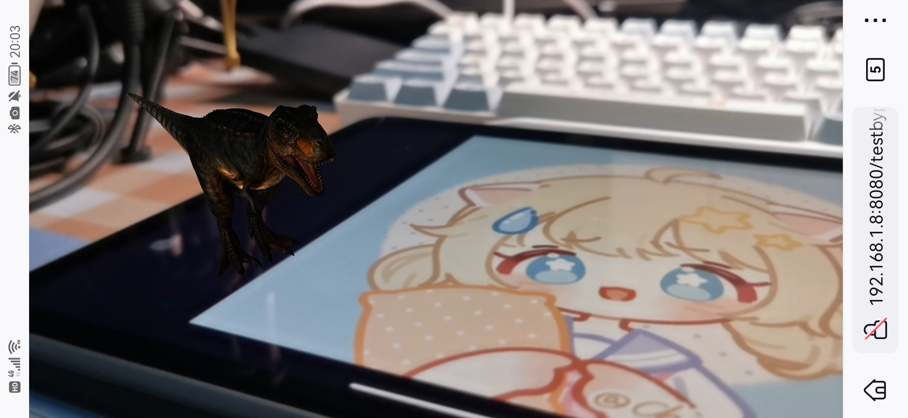

# Yuumi's webAR

在根目录下打开命令行，执行：

```shell
live-server --https=./node_modules/live-server-https
```

这样，同一局域网下的设备都可以连接到网页！

1. 打开网址：https://192.168.xxx.xxx:8080 （xxx为你的ip地址，在主机上运行时会显示在浏览器上），对 trex 目录下的 hiro.png 拍摄，可以看到 `Hello World!`

	

2. 打开网址：https://192.168.xxx.xxx:8080/testByPicture.html ，对 trex 目录下的 yuumi.png 拍摄，可以看到一只旋转的小黑恐龙

	